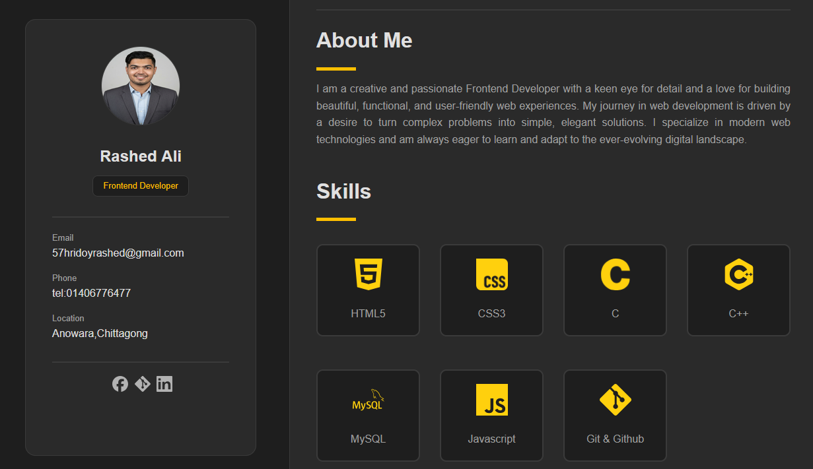

# 🌐 Personal Portfolio Website

A modern and responsive **personal portfolio website** built using **HTML5 and CSS3**.  
This project showcases my skills, education, and frontend development work.

---

## 🚀 Live Demo

👉 **Live Website:** https://osdrashedali.github.io/My-Portfolio/

---

## 📸 Preview

---

## ✨ Features

- 📱 Fully responsive design (Mobile, Tablet, Desktop)
- 🎯 Clean sidebar profile layout
- 👨‍💻 About Me section
- 🧠 Skills showcase section
- 🎓 Education timeline
- 📁 Project showcase section
- 🔗 Social media integration
- ⚡ Fast and lightweight UI

---

## 🛠️ Tech Stack

- HTML5  
- CSS3 (Flexbox + Grid)  
- Media Queries (Responsive Design)

---

## 📱 Responsive Design

- 📱 Mobile Devices  
- 📟 Tablets  
- 💻 Desktop Screens  

---

## 📂 Project Structure

├── index.html
├── styles/
│   └── style.css
├── images/
│   └── profile.png
└── README.md

---

## 👨‍💻 Author

**Rashed Ali**  
Frontend Developer | CSE Student

📧 Email: 57hridoyrashed@gmail.com  
📍 Location: Anowara, Chattogram, Bangladesh  
🔗 GitHub: https://github.com/osdrashedali  
🔗 LinkedIn: https://www.linkedin.com/in/rashed-ali-b767473bb/

---

## 🎯 About This Project

This project was built to practice frontend development and improve HTML & CSS skills.

---

## 🚀 Future Improvements

- Add JavaScript interactivity  
- Dark/Light mode toggle 🌙  
- Backend integration  
- More projects section  

---

## ⭐ Support

If you like this project, give it a ⭐ on GitHub.

---

## 📜 License

This project is open source and free to use.
